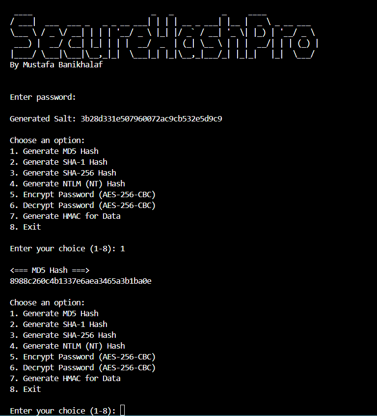

# SecureHashPro

## Overview :

**SecureHashPro** is a Python-based tool designed for generating secure password hashes and encrypting sensitive data. It supports multiple hashing algorithms, including MD5, SHA-1, SHA-256, and NTLM, and provides advanced features like AES-256-CBC encryption, HMAC generation, and salting. This tool is ideal for educational purposes, offering a hands-on way to learn about cryptography and secure password handling.

---

## Key Features :

### Password Hashing
- Generates MD5, SHA-1, SHA-256, and NTLM hashes.
- Uses random **salting** to enhance security and prevent rainbow table attacks.

### AES Encryption
- Encrypts data using **AES-256-CBC**, a robust encryption standard.
- Generates a unique encryption key and initialization vector (IV) for each operation.

### Data Integrity
- Generates **HMAC (Hash-based Message Authentication Code)** for encrypted data to ensure its integrity and authenticity.

### Interactive Menu
- Provides a user-friendly menu for selecting operations such as hashing, encryption, decryption, and HMAC generation.

### Secure Input
- Uses the `getpass` module to securely input passwords without displaying them on the screen.

---

## How It Works :

1. **Hashing**: The tool generates hashes for a given password using MD5, SHA-1, SHA-256, or NTLM algorithms. A random salt is added to the password before hashing to improve security.
2. **Encryption**: Passwords or other sensitive data can be encrypted using AES-256-CBC. The tool generates a random encryption key and IV for each operation.
3. **HMAC Generation**: HMAC is generated for encrypted data to ensure its integrity and detect any tampering.
4. **Interactive Menu**: Users can choose from a menu of options to perform specific operations, such as generating hashes, encrypting data, decrypting data, or generating HMAC.

---

## Usage

### Installation :

1. Clone the repository:
   ```bash
   git clone https://github.com/your-username/SecureHashPro.git
   ```
2. Navigate to the project directory:
   ```bash
   cd SecureHashPro
   ```
3. Install the required dependencies:
   ```bash
   pip install -r requirements.txt
   ```

## Running the Script :

Run the script using Python:
```bash
python SecureHashPro.py
```

## Interactive Menu : 

The script will display a menu with the following options:

- Generate MD5 Hash
- Generate SHA-1 Hash
- Generate SHA-256 Hash
- Generate NTLM (NT) Hash
- Encrypt Password (AES-256-CBC)
- Decrypt Password (AES-256-CBC)
- Generate HMAC for Data
- Exit

## Security Note :

This tool is intended for educational purposes only and should not be used in production environments. For real-world applications, always use secure and modern password hashing algorithms like bcrypt or Argon2, and follow best practices for encryption and data security.

## Why Use SecureHashPro?

- Educational Value: Learn about password hashing, encryption, and data integrity in a hands-on way.
- Versatility: Supports multiple hashing algorithms and encryption techniques.
- Ease of Use: The interactive menu makes it simple to perform various operations.
- Security Demonstrations: Demonstrates the importance of salting, encryption, and HMAC in securing data.

## License
This project is licensed under the MIT License. See the LICENSE file for details.

## Author
Mustafa Banikhalaf

## Contributing :

Contributions are welcome! If you'd like to contribute to this project, please:

- Fork the repository.
- Create a new branch for your feature or bugfix.
- Submit a pull request.

## Acknowledgments :

This tool uses the following libraries:

- hashlib for generating MD5, SHA-1, and SHA-256 hashes.
- Cryptodome for generating NTLM hashes and AES encryption.
- getpass for secure password input.

